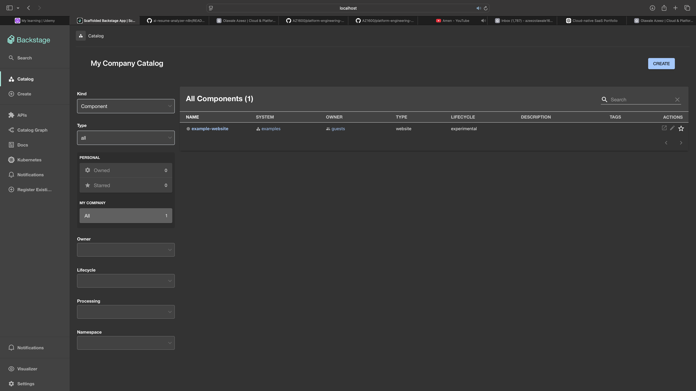
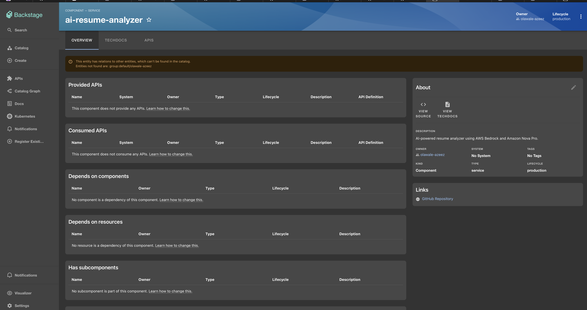
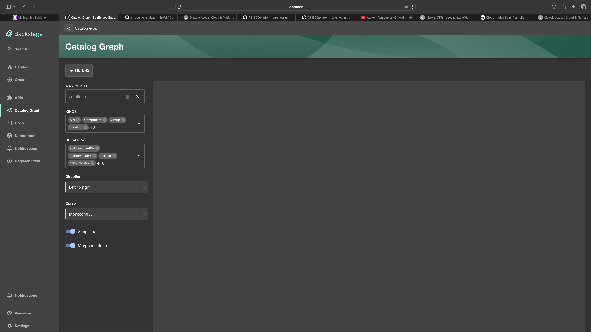
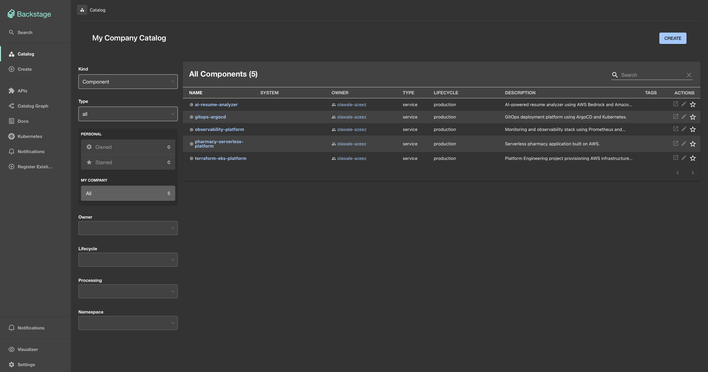

# Platform Engineering Developer Portal

## Overview

Internal Developer Platform (IDP) built using Backstage to centralize software catalog management, developer self-service workflows, technical documentation, and platform governance.

The portal provides a unified interface for developers to discover services, access documentation, manage software components, and accelerate application delivery through standardized platform workflows.

This project demonstrates modern Platform Engineering practices focused on improving developer experience, reducing operational complexity, and enabling self-service infrastructure and application management.

---

## Key Features

* Backstage Software Catalog
* Service Discovery and Ownership Tracking
* Internal Developer Portal (IDP)
* Technical Documentation Management
* Developer Self-Service
* Centralized Platform Experience
* Kubernetes Integration
* GitHub Integration
* Platform Governance
* Extensible Plugin Architecture

---

## Architecture

```text
                    Developers
                         │
                         ▼

              Backstage Developer Portal
                         │

      ┌──────────────────┼──────────────────┐
      ▼                  ▼                  ▼

 Software Catalog   Technical Docs     Templates

      ▼                  ▼                  ▼

    GitHub          Documentation      Self-Service

                         │

                         ▼

                 Kubernetes Platform
```

---

## Platform Engineering Concepts

This project demonstrates:

* Internal Developer Platforms (IDP)
* Developer Experience (DevEx)
* Service Catalog Management
* Platform Governance
* Software Ownership Tracking
* Standardized Developer Workflows
* Kubernetes Platform Integration
* Self-Service Engineering

---

## Technologies Used

* Backstage
* TypeScript
* Node.js
* Docker
* Kubernetes
* GitHub
* TechDocs

---
## Screenshots

### Backstage Developer Portal

Initial Backstage deployment used to validate the Internal Developer Platform setup.



---

### Software Catalog

Customized software catalog containing platform engineering and cloud-native portfolio services.



---

### Service Dependency Graph

Visual representation of service ownership, relationships and platform architecture using the Backstage Catalog Graph.



---

### Service Entity Example

Example entity registered within the software catalog.



## Skills Demonstrated

### Platform Engineering

* Internal Developer Platform Design
* Developer Self-Service
* Service Catalog Management
* Platform Governance
* Developer Experience Optimization

### Cloud & DevOps

* Containerization
* Kubernetes Integration
* GitHub Integration
* Platform Automation
* Technical Documentation Management

---

## Project Outcomes

This project demonstrates the ability to:

* Build Internal Developer Platforms
* Improve Developer Experience
* Centralize Software Catalog Management
* Integrate Engineering Tooling
* Enable Self-Service Platform Capabilities
* Standardize Development Workflows
* Implement Platform Engineering Best Practices

---

## Repository Structure

```text
.
├── packages/
│   ├── app/
│   └── backend/
├── plugins/
├── catalog-info.yaml
├── app-config.yaml
├── package.json
└── README.md
```

---

## Future Enhancements

* Software Templates
* Scaffolder Workflows
* Kubernetes Resource Management
* CI/CD Integrations
* Observability Integrations
* Cost Visibility Dashboards
* Internal Platform APIs

---

## Why This Project Matters

Modern engineering organizations increasingly adopt Internal Developer Platforms to improve developer productivity and operational consistency.

This project demonstrates how Backstage can be used as a central platform layer that provides visibility, governance, self-service capabilities, and standardized workflows across engineering teams.

---

## Author

**Olawale Azeez**

Cloud Engineer | Platform Engineer | AWS Solutions Architect

Focused on Platform Engineering, Internal Developer Platforms, Kubernetes, Cloud Infrastructure, and Developer Experience.
