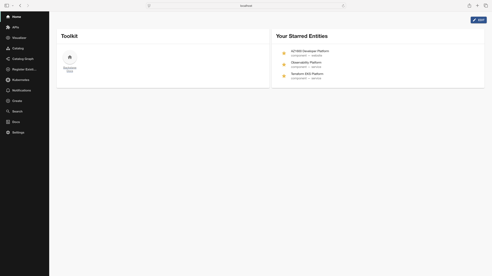
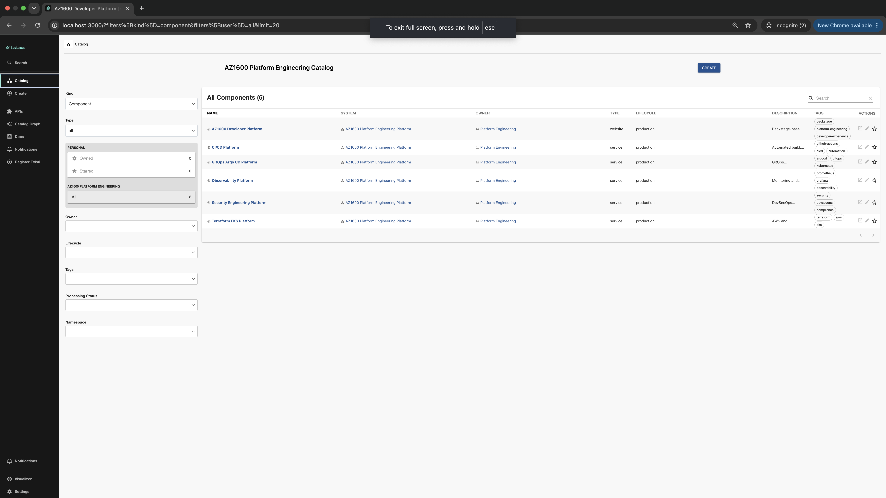
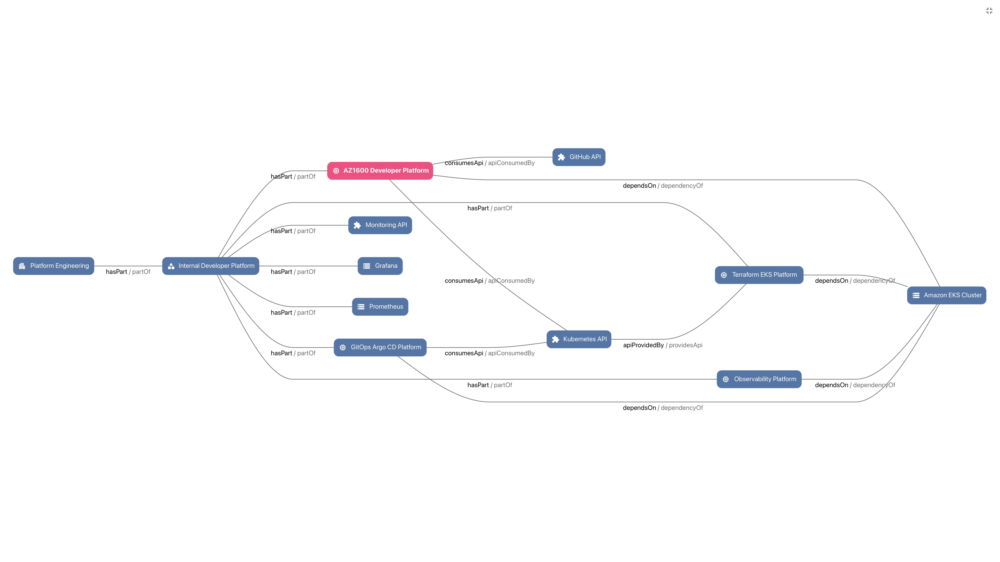
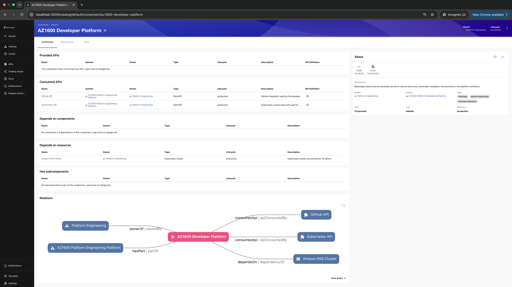
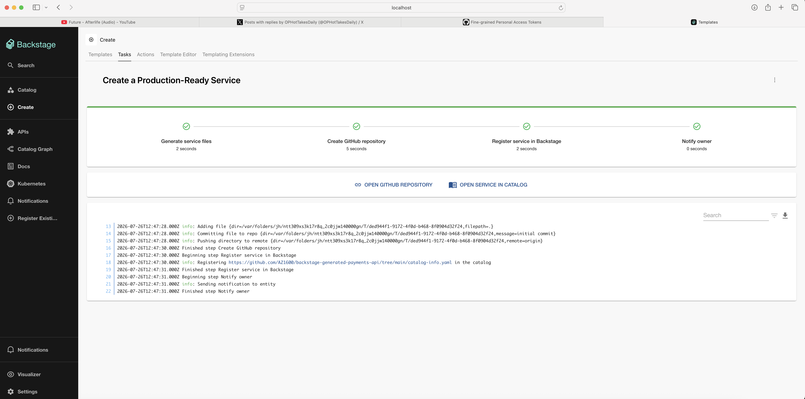

# AZ1600 Platform Engineering Developer Portal

A Backstage-based Internal Developer Platform demonstrating software catalog management, developer self-service, golden paths, service ownership, architecture visibility, and cloud-native platform engineering practices.


---

## Overview

The **AZ1600 Platform Engineering Developer Portal** is an Internal Developer Platform built with **Backstage**.

The project explores how platform engineering teams can provide developers with a single interface for discovering services, understanding ownership, navigating technical documentation, visualizing architecture relationships, and creating new applications through standardized self-service workflows.

Instead of requiring developers to search across repositories, cloud consoles, documentation systems, CI/CD tools, and team knowledge, the portal brings core engineering information into one platform experience.

The goal is to improve:

- Developer experience
- Service discoverability
- Engineering consistency
- Ownership visibility
- Self-service workflows
- Platform standardization
- Cloud-native application delivery

---

## Problem

As engineering environments grow, developers often need to work across many disconnected tools.

Information about a service may be spread across:

- GitHub repositories
- Documentation
- Kubernetes manifests
- CI/CD pipelines
- Cloud infrastructure
- Team knowledge
- Monitoring systems
- Infrastructure repositories

This makes simple questions unnecessarily difficult:

```text
What services exist?
        ↓
Who owns this service?
        ↓
What does it depend on?
        ↓
Where is its documentation?
        ↓
How do I create a new service correctly?
```

An Internal Developer Platform provides a centralized layer over those systems.

---

## Solution

The AZ1600 Developer Portal uses Backstage to provide a centralized developer experience around:

- Software catalog management
- Service ownership
- Architecture relationships
- Technical documentation
- Golden-path software templates
- Self-service application creation
- Platform metadata
- Cloud-native development standards

The portal acts as the developer-facing layer of a wider platform engineering architecture.

---

# Platform Capabilities

## Software Catalog

The Backstage Software Catalog provides a centralized inventory of engineering entities.

Examples include:

- Applications
- Services
- APIs
- Infrastructure resources
- Platform components
- Systems
- Teams
- Ownership metadata

Developers can use the catalog to understand what exists, who owns it, and how it relates to other parts of the platform.

A catalog entity can include:

- Component name
- Description
- Owner
- Lifecycle stage
- System membership
- APIs
- Dependencies
- Resources
- Documentation links

This creates a searchable source of truth for software and platform metadata.

---

## Developer Self-Service

The project includes a Backstage Scaffolder workflow for generating new applications from reusable software templates.

Rather than manually repeating application setup tasks, developers can follow a standardized golden path.

The template can provide a starting structure containing:

- Application source code
- Tests
- CI configuration
- Docker configuration
- Kubernetes manifests
- Backstage catalog metadata
- Technical documentation
- Ownership information

A typical workflow looks like:

```text
Developer
    ↓
Backstage Portal
    ↓
Choose Software Template
    ↓
Provide Service Metadata
    ↓
Generate Application Structure
    ↓
Create Repository
    ↓
Configure CI
    ↓
Add Kubernetes Manifests
    ↓
Prepare TechDocs
    ↓
Register Component
```

The aim is to reduce repetitive setup work while promoting consistent engineering standards.

---

## Golden Paths

Golden paths provide developers with an approved starting point for common engineering tasks.

Instead of every team creating its own repository structure, CI pipeline, Kubernetes manifests, and documentation format, the platform can provide reusable templates.

This helps standardize:

- Repository structure
- CI workflows
- Container configuration
- Documentation
- Catalog metadata
- Kubernetes deployment patterns
- Service ownership

Golden paths do not remove developer flexibility.

They provide a supported default that reduces unnecessary setup and cognitive load.

---

## Technical Documentation

Documentation is designed around Backstage TechDocs.

Each registered service can include documentation covering areas such as:

- Architecture
- Development setup
- Operational procedures
- Deployment
- Dependencies
- Ownership
- Troubleshooting

The goal is to keep technical documentation close to the service metadata rather than forcing developers to discover it through separate systems.

---

## Service Ownership

Ownership is an important part of the platform model.

Catalog metadata can make it clear which engineering team is responsible for a service, platform component, API, or infrastructure resource.

This helps answer operational questions such as:

```text
A service has an issue
        ↓
Identify the catalog entity
        ↓
Find the owning team
        ↓
Inspect dependencies and documentation
        ↓
Route the issue to the right engineers
```

---

## Architecture Visibility

The Backstage catalog represents relationships between platform entities.

Instead of treating services as isolated records, the portal can model relationships between:

- Components
- Systems
- APIs
- Resources
- Teams
- Infrastructure platforms

This allows engineers to understand both technical and organizational context.

---

## Kubernetes Platform Target

The platform is designed with Kubernetes-based workloads in mind.

The target architecture includes:

- Amazon EKS
- Kubernetes workloads
- Terraform-managed infrastructure
- GitOps-based deployment
- Platform service visibility

The current repository demonstrates the portal and catalog model, while deeper live Kubernetes and EKS integration remains part of the roadmap.

---

# Architecture

The developer portal represents the interface between developers and the underlying platform capabilities.

```text
                         Developers
                              │
                              ▼
                 Backstage Developer Portal
                              │
        ┌─────────────────────┼─────────────────────┐
        │                     │                     │
        ▼                     ▼                     ▼
 Software Catalog          TechDocs             Scaffolder
        │                     │                     │
        ▼                     ▼                     ▼
Services / APIs        Documentation        Software Templates
        │                                           │
        └───────────────────┬───────────────────────┘
                            │
                            ▼
                  Platform Engineering Layer
                            │
        ┌───────────────────┼───────────────────┐
        │                   │                   │
        ▼                   ▼                   ▼
    Kubernetes          Terraform            GitOps
        │                   │                   │
        └───────────────────┼───────────────────┘
                            │
                            ▼
                       AWS / EKS
```

The current project focuses primarily on the **developer portal, catalog, metadata, documentation, and scaffolder experience**.

Real production EKS, GitOps, and observability integrations are planned extensions.

---

# Technology Stack

| Area | Technology |
|---|---|
| Developer Portal | Backstage |
| Frontend | React + TypeScript |
| Backend | Node.js |
| Database | SQLite |
| Documentation | Backstage TechDocs |
| Software Templates | Backstage Scaffolder |
| Source Control | GitHub |
| Cloud Target | AWS |
| Container Platform Target | Kubernetes / Amazon EKS |
| Infrastructure as Code Target | Terraform |
| GitOps Target | Argo CD |
| Observability Target | Prometheus / Grafana |

---

# Repository Structure

```text
.
├── packages/
│   ├── app/                     # Backstage frontend
│   └── backend/                 # Backstage backend
│
├── examples/
│   ├── template/
│   │   └── content/
│   │       ├── .github/
│   │       │   └── workflows/
│   │       │       └── ci.yml
│   │       ├── app/
│   │       ├── docs/
│   │       ├── kubernetes/
│   │       │   ├── deployment.yaml
│   │       │   └── service.yaml
│   │       ├── tests/
│   │       ├── catalog-info.yaml
│   │       ├── Dockerfile
│   │       ├── mkdocs.yml
│   │       ├── README.md
│   │       └── requirements.txt
│   │
│   ├── entities.yaml
│   ├── org.yaml
│   ├── platform-catalog.yaml
│   └── platform-org.yaml
│
├── docs/
│   ├── backstage-homepage.png
│   ├── catalog-overview.png
│   ├── catalog-architecture.png
│   ├── entity-page.png
│   └── scaffolder-success.png
│
├── app-config.yaml
├── catalog-info.yaml
├── package.json
└── yarn.lock
```

---

# Developer Workflow

A typical golden-path workflow through the platform:

```text
Developer
    ↓
Backstage Portal
    ↓
Select Software Template
    ↓
Provide Service Metadata
    ↓
Generate Application
    ↓
Create Repository
    ↓
Configure CI + Kubernetes
    ↓
Register Catalog Entity
    ↓
Publish Documentation
    ↓
Prepare for Deployment
```

The platform is intended to reduce the amount of infrastructure and repository knowledge a developer needs before creating a correctly structured service.

---

# Software Catalog

The catalog models platform components including areas such as:

- AZ1600 Developer Platform
- Kubernetes Platform
- Observability Platform
- GitOps Platform
- Monitoring APIs
- Cloud infrastructure resources

Catalog entities can expose:

- Ownership information
- Lifecycle status
- System relationships
- APIs
- Dependencies
- Infrastructure relationships
- Architecture visualization

---

# Platform Screenshots

The screenshots below demonstrate the main workflows provided by the Backstage-based Internal Developer Platform, including service discovery, architecture visibility, ownership, entity metadata, and self-service software creation.

---

## Backstage Homepage



The homepage provides the main entry point into the developer portal.

It gives engineers a centralized interface for discovering platform capabilities instead of navigating between separate repositories, documentation systems, infrastructure tools, and service inventories.

From the portal, developers can move into the Software Catalog, documentation, APIs, software templates, and other self-service workflows.

The purpose of this view is to make the platform itself easy to discover and provide developers with a consistent starting point for common engineering tasks.

---

## Software Catalog



The Software Catalog provides a centralized inventory of registered applications, services, APIs, infrastructure components, systems, and platform resources.

Instead of relying on tribal knowledge, engineers can inspect structured metadata to understand:

- What services exist
- Who owns each component
- Which lifecycle stage it is in
- Which system it belongs to
- Which APIs or resources are associated with it
- How it relates to other parts of the platform

The catalog acts as a searchable source of truth for engineering ownership and platform metadata.

A developer should be able to move from:

```text
Service discovery
        ↓
Ownership
        ↓
System context
        ↓
Dependencies
        ↓
Documentation
```

without leaving the portal.

---

## Catalog Architecture Graph



The architecture graph visualizes relationships between entities registered in the Backstage Software Catalog.

Instead of presenting services as isolated catalog records, the graph shows how platform components, APIs, systems, and infrastructure resources connect to one another.

This view can help engineers understand:

- Upstream dependencies
- Downstream dependencies
- API relationships
- Platform ownership
- Infrastructure relationships
- System boundaries

The graph provides architectural context when investigating a service or considering the impact of a platform change.

It also demonstrates how an Internal Developer Platform can become more than a list of repositories by representing the engineering system as a connected model.

---

## Entity Management



Every registered Backstage entity can have a dedicated page containing its technical and organizational context.

The entity page brings together information that would otherwise be spread across repositories, documentation, infrastructure systems, and team knowledge.

Depending on the entity, engineers can inspect:

- Name and description
- Owner
- Lifecycle
- System membership
- APIs
- Dependencies
- Dependent components
- Infrastructure resources
- Related links
- Documentation

The relationship graph provides additional context by showing how the selected entity fits into the wider platform.

This helps make both **technical dependencies** and **service ownership** visible from one interface.

---

## Self-Service Software Creation



Backstage Scaffolder provides the self-service application creation experience.

Instead of manually creating repository structure, CI configuration, Kubernetes resources, documentation, catalog metadata, and container files, developers can start from a standardized software template.

A scaffolder workflow can follow:

```text
Developer
    ↓
Choose Template
    ↓
Enter Service Metadata
    ↓
Generate Source Code
    ↓
Add Tests
    ↓
Configure CI
    ↓
Generate Docker Configuration
    ↓
Generate Kubernetes Resources
    ↓
Create TechDocs
    ↓
Register Backstage Entity
```

The successful scaffolder execution demonstrates the principle of **developer self-service through golden paths**.

The goal is not simply to generate code.

It is to give new services a consistent engineering foundation from the moment they are created.

---

# Running Locally

## Requirements

Install:

- Node.js
- Yarn
- Git
- Docker

---

## Install Dependencies

```bash
yarn install
```

---

## Start Backstage

```bash
yarn dev
```

The development environment starts the Backstage application locally.

Frontend:

```text
http://localhost:3000
```

Backend:

```text
http://localhost:7007
```

---

# Engineering Principles

## Golden Path Engineering

Developers should have a supported default path for creating new services without being forced to understand every underlying platform implementation detail.

---

## Self-Service

Common engineering tasks should be available through reusable workflows rather than requiring manual platform-team intervention.

---

## Automation First

Repeated setup tasks should be automated wherever practical.

Examples include:

- Repository structure
- CI configuration
- Kubernetes manifests
- Documentation
- Catalog registration

---

## Service Ownership

Every production-oriented component should have clear ownership.

Ownership metadata reduces uncertainty during operational incidents and platform changes.

---

## Discoverability

Services, APIs, documentation, dependencies, and owners should be easy to discover from one interface.

---

## Infrastructure as Code

Infrastructure and platform configuration should be version controlled and reproducible.

Terraform is the intended infrastructure management approach for the wider platform architecture.

---

## Cloud-Native Architecture

The platform is designed around containerized workloads, Kubernetes, AWS, automation, and GitOps-oriented delivery.

---

# Skills Demonstrated

## Platform Engineering

- Internal Developer Platforms
- Developer experience
- Golden paths
- Service ownership
- Platform standardization
- Self-service workflows

## Backstage

- Software Catalog
- Scaffolder
- Catalog entities
- Entity relationships
- TechDocs architecture
- Platform metadata

## Cloud Engineering

- AWS architecture
- Kubernetes platform design
- Amazon EKS concepts
- Terraform-based infrastructure design
- Cloud-native application delivery

## DevOps

- CI workflow foundations
- Containerization
- Kubernetes manifests
- Git-based workflows
- Automation

## Software Engineering

- React
- TypeScript
- Node.js
- Template-driven development
- Application metadata modeling

---

# Future Roadmap

## Kubernetes Production Integration

Planned improvements include:

- Connect real Amazon EKS clusters
- Surface workload status in Backstage
- Display deployment information
- Expose environment metadata

---

## GitOps Integration

Planned GitOps capabilities:

- Argo CD integration
- Application deployment visibility
- Automated deployment workflows
- Environment promotion
- Deployment health information

---

## CI/CD Automation

Future improvements include:

- Standardized GitHub Actions templates
- Automated testing pipelines
- Security scanning
- Build validation
- Deployment workflow templates

---

## Platform Governance

Potential governance features include:

- Role-based access control
- Service ownership policies
- Metadata validation
- Compliance automation
- Platform standards enforcement

---

## Observability

Planned observability integrations include:

- Prometheus metrics
- Grafana dashboards
- Application health information
- Service-level operational visibility
- Alert and incident context

---

## Developer Experience

Further developer-experience improvements could include:

- Additional software templates
- More golden paths
- API documentation
- Cost information
- Security metadata
- Scorecards
- Platform health indicators

---

# Project Status

The repository currently demonstrates a working Backstage-based developer portal with:

- Software Catalog
- Platform entities
- Entity relationships
- Architecture visualization
- Self-service scaffolding
- Software templates
- Technical documentation foundations
- Ownership metadata
- Cloud-native service templates

Production integrations with real EKS environments, Argo CD, Prometheus, and Grafana remain planned extensions of the platform.

---

# License

Internal Platform Engineering portfolio project.

Built to demonstrate Internal Developer Platform concepts, developer self-service, platform engineering workflows, and cloud-native engineering standards.

---

# Author

**Olawale Azeez**

Cloud Engineer | Platform Engineer | AWS Certified Developer

Focused on Platform Engineering, Internal Developer Platforms, Kubernetes, Cloud Infrastructure, Infrastructure as Code, and Developer Experience.

Portfolio: [Olawale Azeez Portfolio](https://az1600.github.io)

GitHub: [AZ1600](https://github.com/AZ1600)
