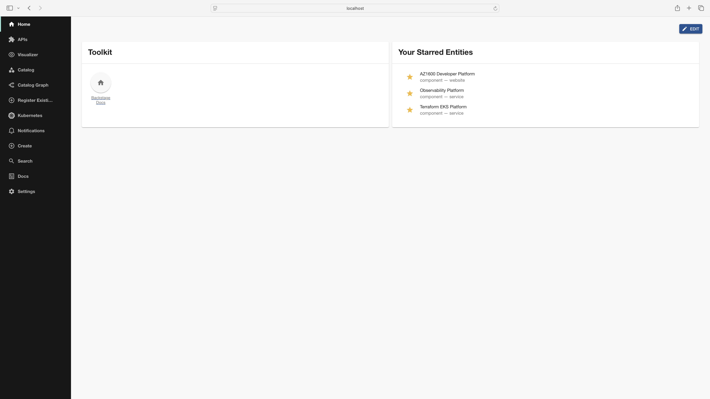
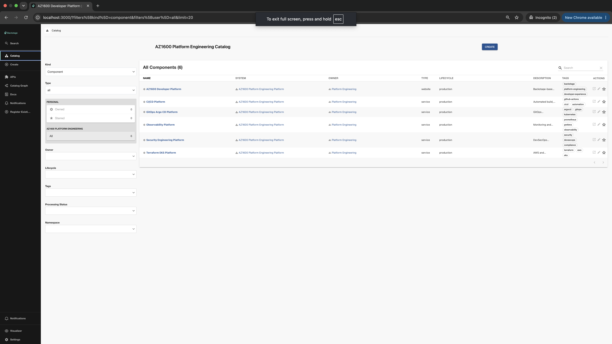
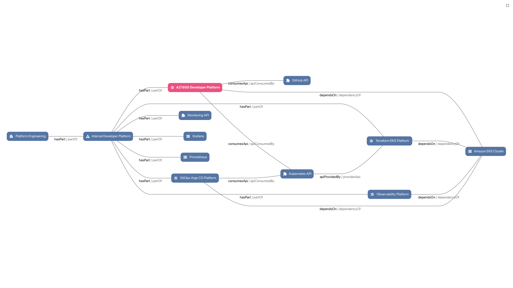
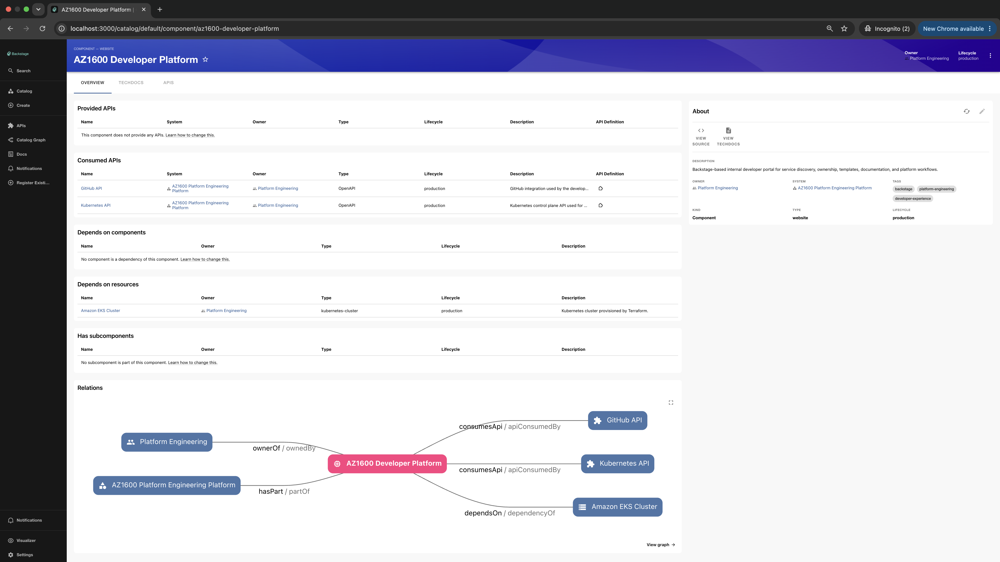
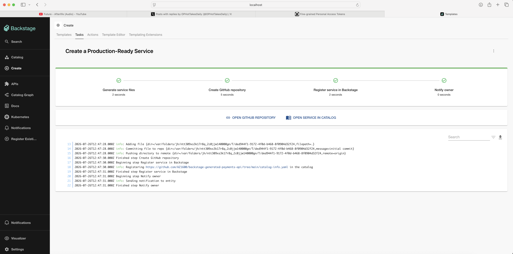

# AZ1600 Platform Engineering Developer Portal

A Backstage-based Internal Developer Platform demonstrating developer self-service, software catalog governance, golden paths, production-oriented authentication and authorization, secure container delivery, Kubernetes workload standards, automated validation, and software supply-chain security.


---

## Overview

The **AZ1600 Platform Engineering Developer Portal** is an Internal Developer Platform built with **Backstage**.

The project demonstrates how a platform engineering team can provide developers with a centralized interface for:

- discovering services
- identifying ownership
- understanding architecture relationships
- accessing technical documentation
- generating new services through approved golden paths
- applying platform security standards automatically
- validating catalog metadata
- enforcing CI quality and security gates

Rather than requiring application teams to manually assemble repository structure, CI pipelines, container configuration, Kubernetes manifests, documentation, catalog metadata, and security controls, the platform provides reusable defaults through Backstage.

The project has evolved beyond a basic Backstage installation into a production-oriented platform engineering reference implementation.

---

# Platform Goals

The platform is designed around several core goals:

- improve developer experience
- reduce repeated service setup work
- establish secure golden paths
- make service ownership discoverable
- standardize application delivery
- validate platform metadata automatically
- provide production-oriented identity controls
- prevent vulnerable container images from passing CI
- make platform standards executable rather than purely documented

---

# Problem

As engineering organizations grow, service information often becomes fragmented across:

- GitHub repositories
- Kubernetes clusters
- documentation systems
- CI/CD pipelines
- cloud consoles
- infrastructure repositories
- monitoring tools
- team knowledge

Developers may need to answer questions such as:

```text
What services exist?
        ↓
Who owns this service?
        ↓
What system does it belong to?
        ↓
What APIs does it provide?
        ↓
What does it depend on?
        ↓
Where is the documentation?
        ↓
How do I create a new service correctly?
        ↓
Which security and deployment standards must I follow?
```

Without a developer platform, much of this knowledge becomes tribal knowledge.

---

# Solution

The AZ1600 Developer Portal provides a Backstage-based platform layer that brings these concerns together.

```text
                         Developers
                              │
                              ▼
                 Backstage Developer Portal
                              │
          ┌───────────────────┼───────────────────┐
          │                   │                   │
          ▼                   ▼                   ▼
    Software Catalog       TechDocs          Scaffolder
          │                   │                   │
          ▼                   ▼                   ▼
       Ownership        Documentation       Golden Paths
          │                                       │
          └───────────────────┬───────────────────┘
                              │
                              ▼
                   Platform Engineering Layer
                              │
       ┌──────────────────────┼──────────────────────┐
       │                      │                      │
       ▼                      ▼                      ▼
 GitHub Actions          Kubernetes             Security
       │                      │                      │
       ▼                      ▼                      ▼
 Build / Test / Scan     Workload Standards    Trivy Gates
       │                      │                      │
       └──────────────────────┼──────────────────────┘
                              │
                              ▼
                         AWS / EKS
```

---

# Implemented Capabilities

## Software Catalog

The Backstage Software Catalog provides a centralized inventory of platform entities.

The project models entities including:

- Components
- Systems
- APIs
- Resources
- Domains
- Groups
- Users

Catalog metadata can describe:

- ownership
- lifecycle
- system membership
- dependencies
- APIs provided
- APIs consumed
- infrastructure relationships
- documentation links

The catalog acts as a searchable source of truth for platform metadata.

---

## Semantic Catalog Validation

Valid YAML does not necessarily mean a valid Backstage catalog.

The repository therefore includes:

```text
scripts/validate-catalog.mjs
```

The validator checks catalog relationships offline before changes are merged.

It validates areas including:

- supported entity kinds
- required metadata
- duplicate entity references
- owners
- systems
- domains
- APIs
- dependencies
- group relationships

Run:

```bash
yarn validate:catalog
```

Example successful result:

```text
Catalog validation passed: 22 entities across 3 files.
```

This provides a stronger guarantee than syntax validation alone.

---

# Developer Self-Service

Backstage Scaffolder is used to provide a self-service workflow for creating new applications.

Instead of manually assembling every repository, developers can start from a standard service template.

A typical workflow is:

```text
Developer
    ↓
Backstage Portal
    ↓
Select Software Template
    ↓
Enter Service Metadata
    ↓
Generate Application
    ↓
Create Source Structure
    ↓
Add Tests
    ↓
Configure CI
    ↓
Generate Container Definition
    ↓
Generate Kubernetes Manifests
    ↓
Prepare TechDocs
    ↓
Register Catalog Entity
```

The objective is to make the correct engineering path the easiest path.

---

# Golden Path Service Template

The repository contains a reusable service template under:

```text
examples/template/
```

Generated service content includes:

```text
examples/template/content/
├── .github/
│   └── workflows/
│       └── ci.yml
├── app/
├── docs/
├── kubernetes/
│   ├── deployment.yaml
│   ├── networkpolicy.yaml
│   ├── pdb.yaml
│   └── service.yaml
├── tests/
├── catalog-info.yaml
├── Dockerfile
├── mkdocs.yml
├── README.md
└── requirements.txt
```

The template demonstrates how platform standards can be embedded directly into generated services.

---

# Secure Golden Path Defaults

The generated FastAPI service uses production-oriented defaults.

## Container Hardening

The generated container includes:

- fixed non-root UID/GID
- explicit file ownership
- non-root runtime
- health check
- deterministic application directory
- minimal Python base image

Example runtime identity:

```text
uid=10001(appuser) gid=10001(appgroup)
```

---

## Kubernetes Workload Hardening

The generated Kubernetes deployment includes controls such as:

- non-root execution
- restricted privilege escalation
- dropped Linux capabilities
- health probes
- resource configuration
- safer rollout behavior

Additional generated resources include:

```text
PodDisruptionBudget
NetworkPolicy
```

These defaults reduce the amount of Kubernetes security knowledge required from every application developer.

---

# Golden Path CI

Generated services include a GitHub Actions workflow.

The template CI provides a repeatable baseline for service validation and security scanning.

The platform therefore does more than generate application code.

It also generates part of the software delivery process.

---

# Production Authentication

Development convenience and production identity are intentionally separated.

The production Backstage configuration supports GitHub authentication using environment-provided credentials.

Expected configuration values include:

```text
AUTH_GITHUB_CLIENT_ID
AUTH_GITHUB_CLIENT_SECRET
```

Secrets are not committed to the repository.

Production configuration is validated in CI using harmless placeholder values.

---

# Authorization

The platform does not rely on the default allow-all permission model for production-oriented operation.

A custom permission policy is registered in the Backstage backend.

The authorization model is designed around:

- authenticated identities
- catalog ownership
- protection of destructive catalog operations
- restricted Kubernetes proxy behavior
- normal portal discovery for authenticated users

This demonstrates the distinction between:

```text
Authentication
Who are you?

Authorization
What are you allowed to do?
```

---

# Production Configuration Validation

Backstage production configuration is validated automatically.

CI runs:

```bash
yarn backstage-cli config:check --strict \
  --config app-config.yaml \
  --config app-config.production.yaml
```

The workflow provides temporary placeholder environment values for required production configuration.

This catches invalid configuration before deployment.

---

# Backstage Production Container

The Backstage backend is packaged as a production container.

The image uses:

```text
node:24-trixie-slim
```

and is configured to run as the built-in non-root Node user.

Runtime validation confirms:

```text
uid=1000(node) gid=1000(node)
```

---

## Reduced Runtime Attack Surface

Build-time tooling is removed from the runtime image when it is not required.

In particular, npm and npx are removed after application dependencies have been prepared.

```dockerfile
RUN rm -rf /usr/local/lib/node_modules/npm \
    && rm -f /usr/local/bin/npm /usr/local/bin/npx
```

The backend itself continues to run directly with Node.js.

This reduces unnecessary packages in the production runtime.

---

## Build Dependencies vs Runtime Dependencies

Native-module tooling such as `node-gyp` is treated as build tooling rather than an application runtime requirement.

Moving unnecessary build tools out of runtime dependency sets reduced the production dependency tree and removed vulnerable packages that did not need to ship with the application.

---

# Container Operating-System Security

The image updates available Debian security packages before installing required build dependencies.

```dockerfile
apt-get update
apt-get upgrade -y
```

This ensures container security is not limited only to JavaScript package updates.

Operating-system dependencies are also part of the vulnerability-management process.

---

# Software Supply-Chain Security

The project uses Trivy as an enforced security gate.

Two areas are scanned.

## Golden Path Infrastructure

```text
examples/template/content
```

is scanned as infrastructure configuration.

This helps detect unsafe defaults in the service template before those defaults can be propagated to new applications.

---

## Production Backstage Image

The final production image is scanned for known vulnerabilities.

The CI security policy blocks:

```text
HIGH
CRITICAL
```

vulnerabilities with fixes available.

The gate uses:

```text
severity: HIGH,CRITICAL
ignore-unfixed: true
exit-code: 1
```

The gate was intentionally kept strict during remediation.

It was not weakened to make CI pass.

---

# Vulnerability Remediation

Security validation exposed a number of transitive and runtime vulnerabilities during development.

Affected dependency families included:

```text
vm2
undici
urllib
tar
multer
protobufjs
js-yaml
linkify-it
fast-uri
ip-address
brace-expansion
@grpc/grpc-js
axios
basic-ftp
```

Remediation techniques included:

- recursive compatible upgrades
- upgrading parent dependencies
- targeted Yarn resolutions
- moving build tooling to development dependencies
- removing unused runtime tooling
- updating Debian security packages
- rebuilding containers without cache
- repeatedly rescanning until the original policy passed

The final production image passes:

```bash
trivy image \
  --severity HIGH,CRITICAL \
  --ignore-unfixed \
  --exit-code 1 \
  backstage-portal:ci
```

with exit code:

```text
0
```

The full investigation and remediation history is documented in:

```text
docs/troubleshooting.md
```

---

# Continuous Integration

The Backstage repository includes a GitHub Actions validation pipeline.

The workflow performs:

```text
Checkout repository
        ↓
Set up Node.js
        ↓
Enable Corepack
        ↓
Immutable dependency install
        ↓
Prettier validation
        ↓
Lint
        ↓
TypeScript validation
        ↓
Tests
        ↓
Catalog semantic validation
        ↓
Production configuration validation
        ↓
Backend build
        ↓
Production container build
        ↓
Non-root runtime verification
        ↓
Golden-path configuration security scan
        ↓
Production image vulnerability scan
```

This makes CI a platform-quality gate rather than only a build command.

---

# CI Commands

The main validation commands are:

```bash
yarn install --immutable

yarn prettier:check

yarn lint:all

yarn tsc:full

CI=true yarn test

yarn validate:catalog

yarn build:backend
```

---

# Production Image Validation

Build:

```bash
docker build \
  -f packages/backend/Dockerfile \
  -t backstage-portal:ci \
  .
```

Verify non-root runtime:

```bash
docker run \
  --rm \
  --entrypoint id \
  backstage-portal:ci
```

Expected:

```text
uid=1000(node) gid=1000(node)
```

Security scan:

```bash
trivy image \
  --severity HIGH,CRITICAL \
  --ignore-unfixed \
  --exit-code 1 \
  backstage-portal:ci
```

---

# Architecture

```text
                              Developers
                                   │
                                   ▼
                       Backstage Developer Portal
                                   │
             ┌─────────────────────┼─────────────────────┐
             │                     │                     │
             ▼                     ▼                     ▼
      Software Catalog          TechDocs             Scaffolder
             │                                           │
             │                                           ▼
             │                                    Golden Path
             │                                           │
             │                           ┌───────────────┼───────────────┐
             │                           │               │               │
             │                           ▼               ▼               ▼
             │                          CI           Container       Kubernetes
             │                           │               │               │
             │                           ▼               ▼               ▼
             │                        Tests         Non-root         PDB / Policy
             │                           │               │               │
             └───────────────────────────┼───────────────┼───────────────┘
                                         │
                                         ▼
                                  Security Validation
                                         │
                                   Trivy / Policies
                                         │
                                         ▼
                                  Platform Runtime
                                         │
                         ┌───────────────┼───────────────┐
                         │               │               │
                         ▼               ▼               ▼
                     Kubernetes       Terraform        GitOps
                         │               │               │
                         └───────────────┼───────────────┘
                                         │
                                         ▼
                                      AWS / EKS
```

---

# Technology Stack

| Area                          | Technology                     |
| ----------------------------- | ------------------------------ |
| Developer Portal              | Backstage                      |
| Frontend                      | React + TypeScript             |
| Backend                       | Node.js                        |
| Local Development Database    | SQLite                         |
| Production Database Model     | PostgreSQL configuration       |
| Documentation                 | Backstage TechDocs             |
| Software Templates            | Backstage Scaffolder           |
| Authentication                | GitHub                         |
| Authorization                 | Backstage Permission Framework |
| Source Control                | GitHub                         |
| CI                            | GitHub Actions                 |
| Container Runtime             | Docker                         |
| Container Security            | Trivy                          |
| Deployment Target             | Kubernetes / Amazon EKS        |
| Infrastructure as Code Target | Terraform                      |
| GitOps Target                 | Argo CD                        |
| Observability Target          | Prometheus / Grafana           |

---

# Repository Structure

```text
.
├── .github/
│   └── workflows/
│       └── ci.yml
│
├── docs/
│   ├── backstage-homepage.png
│   ├── catalog-architecture.png
│   ├── catalog-overview.png
│   ├── entity-page.png
│   ├── scaffolder-success.png
│   └── troubleshooting.md
│
├── examples/
│   ├── template/
│   │   ├── content/
│   │   │   ├── .github/
│   │   │   │   └── workflows/
│   │   │   │       └── ci.yml
│   │   │   ├── app/
│   │   │   ├── docs/
│   │   │   ├── kubernetes/
│   │   │   │   ├── deployment.yaml
│   │   │   │   ├── networkpolicy.yaml
│   │   │   │   ├── pdb.yaml
│   │   │   │   └── service.yaml
│   │   │   ├── tests/
│   │   │   ├── catalog-info.yaml
│   │   │   ├── Dockerfile
│   │   │   ├── mkdocs.yml
│   │   │   ├── README.md
│   │   │   └── requirements.txt
│   │   └── template.yaml
│   │
│   ├── entities.yaml
│   ├── org.yaml
│   ├── platform-catalog.yaml
│   └── platform-org.yaml
│
├── packages/
│   ├── app/
│   └── backend/
│       ├── src/
│       ├── Dockerfile
│       └── package.json
│
├── scripts/
│   └── validate-catalog.mjs
│
├── app-config.yaml
├── app-config.production.yaml
├── backstage.json
├── catalog-info.yaml
├── package.json
└── yarn.lock
```

---

# Developer Workflow

A typical platform-assisted application workflow is:

```text
Developer
    ↓
Authenticate to Backstage
    ↓
Discover or create a service
    ↓
Select approved golden path
    ↓
Provide ownership + metadata
    ↓
Generate application
    ↓
Create CI configuration
    ↓
Create secure container definition
    ↓
Create Kubernetes resources
    ↓
Register catalog entity
    ↓
Validate metadata
    ↓
Run security gates
    ↓
Prepare application for deployment
```

---

# Platform Screenshots

## Backstage Homepage



The homepage provides the main entry point into the Internal Developer Platform.

Developers can move from a single interface into:

- software catalog
- APIs
- documentation
- software templates
- platform metadata

---

## Software Catalog



The Software Catalog provides a centralized inventory of registered applications, services, APIs, infrastructure components, systems, and platform resources.

It helps answer:

```text
What exists?
Who owns it?
What lifecycle is it in?
What system is it part of?
What does it depend on?
```

---

## Catalog Architecture Graph



The catalog relationship graph shows how platform entities connect.

This provides context around:

- service dependencies
- API relationships
- system boundaries
- ownership
- infrastructure relationships

The result is a connected platform model rather than a simple repository list.

---

## Entity Management



Individual entities expose technical and organizational context.

Depending on the entity, developers can inspect:

- description
- owner
- lifecycle
- system
- APIs
- dependencies
- dependent components
- resources
- documentation

---

## Self-Service Software Creation



The Scaffolder provides a self-service experience for creating applications using platform-defined defaults.

The generated workload starts with:

- source structure
- tests
- CI
- secure Docker configuration
- Kubernetes manifests
- TechDocs
- catalog metadata

This demonstrates the golden-path principle:

```text
Platform team defines the paved road
        ↓
Developer chooses the paved road
        ↓
Secure and repeatable defaults are generated automatically
```

---

# Running Locally

## Requirements

Install:

- Node.js
- Yarn / Corepack
- Git
- Docker

---

## Install Dependencies

```bash
yarn install --immutable
```

---

## Start Backstage

```bash
yarn dev
```

Frontend:

```text
http://localhost:3000
```

Backend:

```text
http://localhost:7007
```

---

# Validation

Run formatting:

```bash
yarn prettier:check
```

Run lint:

```bash
yarn lint:all
```

Run TypeScript validation:

```bash
yarn tsc:full
```

Run deterministic tests:

```bash
CI=true yarn test
```

Validate the catalog:

```bash
yarn validate:catalog
```

Build the backend:

```bash
yarn build:backend
```

---

# Troubleshooting Journal

Engineering failures and their resolutions are documented in:

```text
docs/troubleshooting.md
```

The journal includes examples covering:

- Backstage dependency resolution
- Yarn 4 behavior
- missing Yarn patch references
- GitHub Actions release resolution
- production authentication
- authorization policy work
- catalog validation
- container hardening
- non-root execution
- runtime attack-surface reduction
- Debian package vulnerabilities
- transitive dependency remediation
- Trivy investigation
- compatibility testing
- security-gate validation

The intention is to preserve not only the final architecture but also the engineering process used to reach it.

---

# Engineering Principles

## Golden Paths

Developers should receive a supported and secure default rather than having to construct every service manually.

---

## Self-Service

Repeated platform tasks should be accessible without requiring platform-team intervention for every application.

---

## Secure by Default

Security controls should be generated automatically wherever practical.

Examples include:

- non-root containers
- Kubernetes security context
- network policy
- disruption budgets
- vulnerability scans
- immutable dependency installs

---

## Least Privilege

Production systems should run with the minimum privileges required.

This includes both:

- application authorization
- container runtime privileges

---

## Shift Left

Problems should be detected before deployment.

The CI pipeline validates:

- formatting
- source quality
- types
- tests
- catalog relationships
- production configuration
- container behavior
- Kubernetes configuration
- vulnerabilities

---

## Ownership

Production-oriented services should have clear ownership.

The catalog exposes ownership as a first-class platform concern.

---

## Discoverability

Services, APIs, dependencies, documentation, and platform resources should be discoverable from one interface.

---

## Automation First

Anything repeatedly performed by developers or platform engineers is a candidate for automation.

---

## Security Gates Should Remain Gates

The Trivy HIGH/CRITICAL policy was not relaxed when vulnerabilities were discovered.

Dependencies and runtime components were remediated until the original security standard passed.

---

# Skills Demonstrated

## Platform Engineering

- Internal Developer Platforms
- Developer experience
- Golden paths
- Self-service workflows
- Platform governance
- Service ownership
- Platform standards
- Secure defaults

## Backstage

- Software Catalog
- Scaffolder
- TechDocs
- Catalog relationships
- GitHub authentication
- Permission framework
- Custom permission policy
- Backend configuration
- Catalog validation

## Kubernetes

- Deployments
- Services
- health probes
- security contexts
- PodDisruptionBudgets
- NetworkPolicies
- container runtime hardening

## DevOps

- GitHub Actions
- immutable dependency installation
- automated testing
- TypeScript validation
- container builds
- CI security gates
- vulnerability scanning

## Security

- Trivy
- dependency remediation
- transitive dependency analysis
- runtime attack-surface reduction
- non-root containers
- operating-system package updates
- production authentication
- authorization controls

## Software Engineering

- React
- TypeScript
- Node.js
- YAML
- Python service templates
- dependency management
- automated validation

---

# Current Project Status

The repository currently demonstrates:

- working Backstage developer portal
- software catalog
- platform entities
- architecture relationships
- service ownership
- self-service scaffolding
- secure golden-path service template
- technical documentation foundations
- GitHub production authentication configuration
- custom authorization policy
- semantic catalog validation
- hardened generated containers
- Kubernetes NetworkPolicy
- Kubernetes PodDisruptionBudget
- GitHub Actions CI
- strict production configuration validation
- production Backstage image build
- non-root runtime verification
- Trivy infrastructure scanning
- Trivy production image scanning
- remediated HIGH/CRITICAL production image
- engineering troubleshooting journal

---

# Future Roadmap

The remaining roadmap focuses primarily on live external integrations rather than basic portal foundations.

## Live Kubernetes Integration

Potential extensions:

- connect a real Amazon EKS cluster
- surface workload health
- show deployment status
- expose environment metadata
- integrate Kubernetes plugin credentials securely

---

## GitOps Integration

Potential extensions:

- Argo CD integration
- deployment visibility
- application synchronization state
- environment promotion
- GitOps health information

---

## Observability Integration

Potential extensions:

- Prometheus metrics
- Grafana dashboards
- service health
- SLO information
- incident context

---

## Additional Golden Paths

Potential templates:

- asynchronous worker
- scheduled job
- frontend application
- event-driven service
- Terraform infrastructure module

---

## Platform Scorecards

Potential governance capabilities:

- ownership completeness
- documentation coverage
- production readiness
- security posture
- CI adoption
- SLO coverage

---

# Security Validation Philosophy

This project intentionally treats security findings as engineering work rather than scanner noise.

The remediation process followed:

```text
Discover vulnerability
        ↓
Identify dependency owner
        ↓
Prefer compatible upgrade
        ↓
Upgrade parent when appropriate
        ↓
Use targeted resolution only when necessary
        ↓
Remove unnecessary runtime tooling
        ↓
Rebuild from scratch
        ↓
Run full functional validation
        ↓
Rescan
        ↓
Repeat until original gate passes
```

This approach avoids simply suppressing vulnerabilities to produce a green CI badge.

---

# Project Documentation

Main project documentation:

```text
README.md
```

Engineering troubleshooting journal:

```text
docs/troubleshooting.md
```

Golden-path generated documentation:

```text
examples/template/content/docs/
```

---

# License

Internal Platform Engineering portfolio project.

Built to demonstrate Internal Developer Platform architecture, developer self-service, Backstage engineering, platform governance, secure golden paths, CI validation, Kubernetes standards, and software supply-chain security.

---

# Author

**Olawale Azeez**

Cloud Engineer | Platform Engineer | AWS Certified Developer

Focused on Platform Engineering, Internal Developer Platforms, Kubernetes, AWS, Infrastructure as Code, Developer Experience, DevSecOps, and Cloud-Native Engineering.

Portfolio: [Olawale Azeez Portfolio](https://az1600.github.io)

GitHub: [AZ1600](https://github.com/AZ1600)
